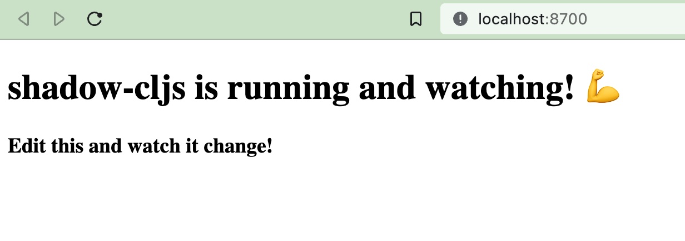

# Bare Bones shadow-cljs + reagent

This is a mini-project to quickly get started with [ClojureScript](https://clojurescript.org) for hacking on a browser app. The project is using:

* [shadow-cljs](https://github.com/thheller/shadow-cljs) for building/compiling and hot reloading ClojureScript.
* [Reagent](https://reagent-project.github.io/) - a most excellent ReactJS wrapper.

## Install

1. Have Node.js installed (also in WSL, if you are using that)
1. Copy the project template to your machine
1. In the project root: install npm dependencies

   ```
   npm i
   ```

## Start the REPL

1. Open the project in your favorite editor with Clojure support, here assuming it is VS Code with [Calva](https://calva.io/)
1. Start the REPL:
   1. Issue the VS Code command: **Calva: Start a project REPL and Connect (a.k.a. Jack-in)**
   1. Select the project type: **shadow-cljs**
   1. Select to start the `:app` build (note, you need to tick the checkbox)
      * The Jack-in Terminal opens, showing the progress, when the app build is complete, you'll get a prompt asking for which build to concect to.
   1. Select to connect to the `:app` build
   1. Open the app in the browser on <http://localhost:8700>

You should see something like this:



The ClojureScript REPL is now running in your browser and Calva is connected to it.

## Hack

The REPL isn't quite ready to use until you have loaded a file.

1. Open [src/main/core.cljs](src/main/core.cljs)
1. Issue the VS Code command: **Calva: Load/Evaluate Current File and Dependencies**

Evaluate some string in file to see that the REPL is working. There is a Rich Comment at the bottom of the file you can use for this as well.

## shadow-cljs hot reload

The browser app is encouraging you to edit it. In the file you loaded, [./src/main/core.cljs](./src/main/core.cljs), you'll find the strings. Try edit one of them and then save the file. Check the browser again. This is shadow-cljs doing its hot-reload thing.

## Learn Calva and Clojure basics

If you are new to Calva and/or Clojure, please consider opening a new VS Code window and issue the VS Code command: **Calva: Fire up the Getting Started REPL**. See [https://calva.io/getting-started/#theres-a-getting-started-repl](https://calva.io/getting-started/#theres-a-getting-started-repl) for what to expect.

## Ask for help

Some beginner resources:

* [Learn ClojureScript](https://www.learn-clojurescript.com/)
* [A collection of Clojure learning materials](https://gist.github.com/ssrihari/0bf159afb781eef7cc552a1a0b17786f)

Please join the [Clojurians Slack](http://clojurians.net) to get help getting started. Some channels to visit/join:

* `#beginners`
* `#clojurescript`
* `#shadow-cljs`
* `#reagent`
* `#calva`

Happy hacking!
